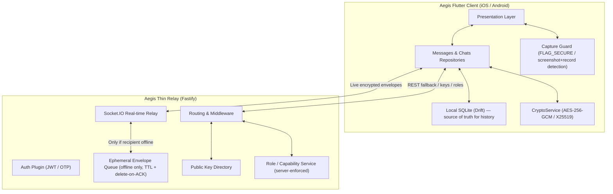

# Aegis Secure Messenger (ibemCom) — README

> **Status:** Pre-launch (no live users yet). This README is the **single source of truth** for Aegis. It consolidates the updated product decisions (local-first storage, thin relay backend, mobile-only production, capability-flag roles) with the agreed build plan and current progress. It supersedes the original `summary.md` handoff guide.

Aegis is a self-hosted, end-to-end-encrypted (E2EE) secure messenger for a **closed group of 2–10 trusted users**. It pairs a Flutter mobile client with a thin, stateless relay backend and a zero-knowledge server that never sees plaintext.

---

## Table of Contents

1. [Key Decisions](#0-key-decisions-tldr)
2. [System Architecture](#1-system-architecture)
3. [Message Delivery Model](#2-message-delivery-model)
4. [Platform Targets](#3-platform-targets)
5. [Roles & Permissions](#4-roles--permissions)
6. [Anti-Capture Protections](#5-anti-capture-protections-mobile)
7. [Cryptographic & Security Protocols](#6-cryptographic--security-protocols)
8. [Data Schemas](#7-data-schemas)
9. [Codebase File Map](#8-codebase-file-map)
10. [Environment Setup & Testing](#9-environment-setup--testing)
11. [Progress & Build Plan](#10-progress--build-plan)
12. [Open Decisions](#11-open-decisions)

---

## 0. Key Decisions (TL;DR)

| Area | Decision |
|---|---|
| **Platforms** | **iOS + Android only** in production. Web is **testing only**. |
| **Storage** | **Local-first.** Chat history lives on-device (Drift/SQLite). Server is a **thin, stateless relay**, not a content database. |
| **Message delivery** | **Live relay when recipient online** (no DB write); **store-and-forward only when offline**, then delete on delivery ACK. |
| **Roles** | Capability-flag model: **Owner**, **Admin**, **Super User**, **User** (flags combine, not a strict ladder). |
| **Encryption** | Hybrid E2EE: AES-256-GCM + X25519 ECDH + HKDF-SHA256. Server never sees plaintext. |
| **Anti-capture** | Native screenshot/recording blocks + in-memory-only media + watermarking (mobile-enforceable; honest best-effort). |

---

## 1. System Architecture

Aegis runs a self-hosted client ↔ thin-relay architecture with strict E2EE. The backend is a **mailbox/relay**, not a system of record for message content.



### Why a server still exists (and why it's tiny)

Asynchronous messaging needs a **mailbox** so a sender can reach an **offline** recipient without both being online simultaneously. This is architectural, not a hosting artifact. The relay therefore does only:

- Public-key directory + device registration
- OTP authentication
- **Store-and-forward of encrypted envelopes for offline recipients**, deleted immediately on delivery ACK
- Role/capability enforcement for server-mediated actions

Nothing accumulates, so there is no large database to maintain or back up.

---

## 2. Message Delivery Model

1. **Recipient online:** server relays the encrypted envelope **live over Socket.IO** straight to the recipient. Recipient stores it in the local Drift DB and returns a **delivery ACK**. **The server does not persist it** (held in memory only until ACK).
2. **Recipient offline:** server places the encrypted envelope in the **ephemeral queue** (SQLite or Redis-with-TTL). On reconnect it is delivered, ACKed, then **deleted**.
3. The server only ever handles **ciphertext** — E2EE is preserved in both paths.

> **Note:** "live delivery" still passes through the server socket (a relay), not literally device-to-device. True P2P (WebRTC + TURN) was evaluated and rejected for a 2–10 user group: more infrastructure, loses offline delivery, little benefit.

### Keeping the relay awake

- Auto-sleep is a **free-tier hosting** behavior. A scheduled **`/health` ping** (cron / uptime monitor ~every 5 min) is an acceptable stopgap — **not** fake "bot" messages, which pollute data.
- Recommended for launch: a small **always-on instance** (~$5 VPS or no-sleep plan). Trivial cost for a thin relay, and removes the "is it awake?" problem entirely.

---

## 3. Platform Targets

- **Production:** iOS and Android (Flutter).
- **Web:** local development & testing only — **not** a shipped target.
- **Rationale:** browsers cannot block screenshots or OS-level screen recording, so the anti-capture guarantees are impossible on web. Restricting production to native mobile makes those protections genuinely enforceable.

---

## 4. Roles & Permissions

Implemented as **capability flags** (combinable), not a rigid hierarchy. A person can hold any combination.

### 4.1 Roles

| Role | Description |
|---|---|
| **Owner** (you) | Root authority. Cannot be revoked or banned. Only role that can mint Admins and grant Super User. Holds all capabilities. |
| **Admin** | Management & oversight. **No message content access.** |
| **Super User** | Invasive content capabilities: call recording + media save/export. |
| **User** | Restricted default. View-only media, no save/export, no recording. |

### 4.2 Admin capabilities (server-enforced, no content access)

**User & access management**
- Onboarding control — invite / approve new members; deactivate / ban users.
- Device & session oversight — list all devices/sessions; force-revoke a session; remote logout; de-trust a compromised device.
- Account recovery assist — trigger OTP reset / regenerate a user's recovery key when locked out.

**Oversight that respects E2EE (metadata only, never content)**
- Activity/metadata dashboard — online status, message counts, timestamps, delivery status, storage usage. No plaintext.
- Key-verification oversight — view device trust/verification status to detect key-substitution (MITM); force a key reset on a suspicious device.
- Audit log — record admin/super-user actions for accountability.

**System controls**
- Broadcast/system announcement — server-signed system message to all users.
- Relay maintenance — inspect undelivered-envelope queue, purge stale/expired envelopes, adjust rate limits.

### 4.3 Super User capabilities (Owner: you)

- **Call recording** (voice + video) — with a **non-bypassable on-screen "recording" indicator** for participants (consent/legal).
- **Save / download / export media** from chats the Super User participates in — exports flagged as admin-exported (or watermark removed) for traceability.

> **Scope:** recording/export apply only to chats the Super User is a **participant** in. This keeps the zero-knowledge model intact (no reading of chats they aren't in).

### 4.4 Granting Super User

- **Feasible:** a server-enforced toggle of the `superUser` flag on a target user.
- **Recommended safeguards:**
  - **Owner-only** grant (or Admin-request + Owner-approval). Avoid letting any Admin freely mint Super Users.
  - **Revocable immediately** (terminates elevated rights on active sessions).
  - **Audit-logged** (who/when/why).
  - **Participant transparency** — recording indicator + "this chat includes a super-user" banner.
  - Optional **cap** on concurrent Super Users.

> **Honest caveat:** recording/export are ultimately *client-side* capabilities. The flag governs the *sanctioned* ability; a modified client could still capture content regardless of flag. Acceptable for a closed, trusted group. Server-mediated powers (ban, revoke, role minting, API access) are genuinely enforceable.

---

## 5. Anti-Capture Protections (mobile)

Best-effort deterrents — strong against normal users on stock devices, not absolute.

**Enforceable**
- **Android:** `FLAG_SECURE` on app windows — blocks screenshots & screen recording in-app and hides app from the recents preview.
- **iOS:** detect screenshots (`UIApplicationUserDidTakeScreenshot`); detect active recording (`UIScreen.isCaptured`) and blur/hide content; obscure content when backgrounded.
- **No save/export UI** for Users; **in-memory-only** media decryption; disable disk caching.
- **Per-user watermark** on displayed media (deterrent + traceability).
- **Root/jailbreak detection** — warn or restrict media on compromised devices (where `FLAG_SECURE`/memory protections can be defeated).

**Cannot be prevented (document honestly)**
- A second camera pointed at the screen.
- Capture on rooted/jailbroken devices.
- Extraction by a technically skilled user running a modified client.

---

## 6. Cryptographic & Security Protocols

Hybrid E2EE; zero-knowledge storage for message bodies and files.

### 6.1 Hybrid E2EE Messaging

1. **Message key:** client generates a random 256-bit key (K_msg) + 96-bit IV.
2. **Payload encryption:** content encrypted with K_msg/IV under **AES-256-GCM**.
3. **Key agreement (X25519):** for each recipient device, ECDH shared secret → **HKDF-SHA256** derived key; K_msg wrapped under it.
4. **Envelope (Socket.IO):**
   ```json
   {
     "sender_device_id": "UUID",
     "ciphertext": "base64(ciphertext + MAC)",
     "iv": "base64(bodyIv)",
     "keys": {
       "recipient_device_id_1": { "key": "base64(encrypted K_msg + MAC)", "iv": "base64(keyIv)" }
     }
   }
   ```
5. **Decryption:** recipient derives shared secret, unwraps K_msg, decrypts ciphertext.

### 6.2 Client-Side Media Encryption

1. Random AES key + IV; encrypt file bytes (AES-256-GCM, tag appended).
2. Request signed upload URL with `encrypted=true`.
3. Backend skips magic-number/Sharp checks and writes raw bytes to `/uploads/{uploaderId}/{mediaId}.bin`.
4. File key + IV + filename packed into a metadata JSON block, E2EE-encrypted as the message content (type `IMAGE`/`VIDEO`/`AUDIO`/`RECORDING`).
5. Receiver decrypts metadata, fetches encrypted stream, decrypts **in memory** for playback/display.

### 6.3 Security Hardening Backlog (prioritized)

1. **Key authentication / anti-MITM (highest):** add safety-number / key-fingerprint verification (TOFU). Without it, a compromised relay could substitute keys. Pair with the Admin **key-verification oversight** feature.
2. **OTP/auth rate-limiting:** strict per-account + per-IP limits, lockout, and short OTP expiry (current rate limiting only covers media uploads).
3. **HKDF context binding:** bind sender/recipient device IDs into the HKDF `info` (currently a static string) to prevent unknown-key-share attacks.
4. **Local at-rest encryption:** encrypt the local Drift DB (e.g., SQLCipher) with a key from secure storage, since `local_messages` holds plaintext.
5. **Recovery-key audit:** confirm the master recovery key is purely client-side and **never** grants the server decryption ability (no backdoor).
6. **Replay protection & ordering:** add envelope nonces/sequence handling on the socket path.
7. **Forward secrecy (decision pending):** static X25519 keys mean a leaked device key exposes past/future messages. Double Ratchet adds forward secrecy + post-compromise security. For a small trusted group this may be deferred — make it a conscious choice.

---

## 7. Data Schemas

### 7.1 Backend (relay) — minimal

Server tables stay lean now that content is local-first:

- **`users`**: records, password hashes, role/capability flags (`owner`, `admin`, `superUser`), recovery key hashes.
- **`password_history`**: current + last 3 hashes (reuse prevention).
- **`devices`**: trusted public keys, fingerprints, push tokens, validation status (`ANDROID`, `IOS`; `WEB` for testing).
- **`sessions`**: refresh tokens, user agents, IPs, expirations (for revoke/oversight).
- **`chats` & `chat_participants`**: membership only.
- **`envelope_queue`**: **ephemeral** offline-only encrypted envelopes (TTL + delete-on-ACK). *Not* a message archive.
- **`audit_log`**: admin/super-user actions.
- **`media`** (transient): uploader IDs, sizes, references for encrypted blobs pending delivery; purge after delivery.

### 7.2 Client (local, source of truth)

- **`local_chats`**: cached chats, last-message preview, timestamp, archived flag.
- **`local_messages`**: decrypted history (consider SQLCipher — see 6.3.4).
- **`sync_queue`**: offline actions (`SEND_MESSAGE`, `MARK_READ`) replayed on reconnect.

---

## 8. Codebase File Map

The workspace has two sub-projects: `frontend` (Flutter client) and `backend` (Fastify relay).

### 8.1 Frontend: Flutter Client (`frontend/`)

- **`lib/main.dart`** — entry point initializing Drift DB, Riverpod providers, Router.
- **`lib/app/`**
  - `router.dart` — navigation with `GoRouter` (Auth, Chat Room, Profile Dashboard).
  - `theme.dart` — typography (`Outfit` / `Inter`), colors, glassmorphism rules.
- **`lib/core/`**
  - `database/local_database.dart` — Drift/SQLite schema: `local_chats`, `local_messages`, `sync_queue`.
  - `network/api_client.dart` — network interface with JWT validation + dynamic headers.
  - `network/socket_client.dart` — Socket.IO client wrapping message queues + ack handlers.
  - `secure_storage/` — keys, user IDs, device fingerprints via `flutter_secure_storage`.
  - `security/crypto_service.dart` — AES-256-GCM encryption/decryption + X25519 key agreement.
  - `security/capture_guard.dart` *(new)* — FLAG_SECURE / screenshot + recording detection.
- **`lib/features/`**
  - `auth/` — sign-in/up, device fingerprinting, OTP widgets.
  - `chats/` — conversation list, recipient avatars, previews.
  - `messages/` — chat room, voice recorder, attachment tray, decrypted media widgets.
  - `profile/` — settings, avatar cropper, password updater, session manager, recovery key, **TOTP setup**.

### 8.2 Backend: Fastify Relay (`backend/`)

- **`src/server.ts`** — bootstrap reading `.env`, launching on port `3000`.
- **`src/app.ts`** — Fastify builder (CORS, Helmet, static dirs, error handlers).
- **`src/plugins/`**
  - `database.plugin.ts` — PostgreSQL (prod) or SQLite (local). Now lean/relay-oriented.
  - `minio.plugin.ts` — upload client (currently stubbed to local `/uploads`).
  - `auth.plugin.ts` — JWT verification hook injecting user context.
  - `rate-limit.plugin.ts` — currently limits `/api/media`; extend to OTP/auth (see 6.3.2).
  - `socket.plugin.ts` — real-time relay routing.
  - `roles.plugin.ts` *(new)* — capability-flag enforcement.
- **`src/modules/`**
  - `auth/` — passwordless OTP generation, validation, registration.
  - `users/` — password updates, sessions, revocation, recovery-key matching, role grant/revoke.
  - `chats/` — group creation, participant joins, key distribution.
  - `devices/` — trust states, public-key declarations, fingerprint validation.
  - `messages/` — relay fallback + delivery logging (no content persistence).
  - `media/` — signed upload/download URLs, file inspections.
  - `relay/` *(new)* — ephemeral envelope queue (TTL + delete-on-ACK).

---

## 9. Environment Setup & Testing

### Prerequisites

- Node.js v18+
- Flutter v3.22+ (stable channel)
- C++ build tools / OpenSSL (Windows)

### Backend (relay)

```bash
cd backend
npm install
cp .env.example .env
npm run dev      # http://localhost:3000
```

Free the port if needed (PowerShell):

```powershell
Stop-Process -Id (Get-NetTCPConnection -LocalPort 3000).OwningProcess -Force
```

### Frontend (web = testing only)

```bash
cd frontend
flutter pub get
flutter run -d chrome --web-port=5000   # testing only; production is iOS/Android
```

### Verification

```bash
cd frontend && flutter analyze && flutter test
cd backend  && npx tsc --noEmit
```

---

## 10. Progress & Build Plan

### ✅ Completed (baseline before re-scope — re-verify against thin-relay / mobile-only)

- **Dependencies resolution** — `bcrypt` → `bcryptjs`, SQLite native bindings for Windows, Dart analysis fixes.
- **Platform integration** — native `WEB` client recognition in registration & device trust.
- **Auth normalization** — identifier trimming / case-normalization for caching & OTP.
- **Static dev ports** — resolved local port conflicts, locked test clients to static ports.
- **E2EE refinements** — X25519 boundary validations, background REST decryption, key-state debug dashboards.
- **Admin & RBAC groundwork** — password history, master recovery keys, session revoke panels, field-access privacy guards.

### Phase A — Foundational (do now)

- [ ] **Refactor backend into a thin relay**
  - [ ] Live delivery over Socket.IO when recipient is online (in memory, no DB write).
  - [ ] Ephemeral offline queue (SQLite or Redis-with-TTL) for offline recipients.
  - [ ] Delete envelopes immediately on delivery ACK.
  - [ ] Strip persistent message-content tables; keep server zero-knowledge.
- [ ] **Capability-flag role model** (Owner / Admin / Super User / User)
  - [ ] Server-enforced gating for server-mediated actions.
  - [ ] Grant / revoke flows (immediate revocation on active sessions).
  - [ ] Audit log for admin & super-user actions.
  - [ ] Admin capabilities (onboarding/ban, device & session oversight, recovery assist, metadata dashboard, key-verification oversight, broadcast, relay maintenance).
  - [ ] Super User capabilities (call recording w/ indicator + media export, participant-scoped).
- [ ] **Mobile anti-capture protections**
  - [ ] Android `FLAG_SECURE` (block screenshots/recording, hide from recents).
  - [ ] iOS screenshot + `UIScreen.isCaptured` detection (blur/hide), obscure when backgrounded.
  - [ ] In-memory-only media decryption; disable disk caching; no save/export UI for Users.
  - [ ] Per-user watermark on displayed media.
  - [ ] Root/jailbreak detection.

### Phase B — Security hardening (prioritized — see §6.3)

- [ ] Key authentication / anti-MITM (TOFU safety numbers) — **highest**.
- [ ] OTP / auth rate-limiting (per-account + per-IP, lockout, short expiry).
- [ ] HKDF context binding (device IDs into `info`).
- [ ] Local at-rest encryption (SQLCipher for Drift DB).
- [ ] Recovery-key audit (confirm no server backdoor).
- [ ] Replay protection & ordering (envelope nonces / sequence).

### Phase C — Production readiness

- [ ] Always-on relay host (replace keep-alive ping).
- [ ] TOTP setup UI (2FA toggle + OTP QR code in Secure Profile Dashboard).
- [ ] Object storage (optional) — swap MinIO stub for `@aws-sdk/client-s3` / `minio` SDK if media volume grows.
- [ ] `docker-compose.prod.yml` (relay + ephemeral store + Nginx/SSL).
- [ ] CI/CD + test coverage.

---

## 11. Open Decisions

- **Super User grant policy:** Owner-only vs. Admin-request + Owner-approval. (§4.4)
- **Forward secrecy:** adopt Double Ratchet or consciously defer for the small trusted group. (§6.3.7)
- **Production relay hosting:** always-on instance vs. interim `/health` keep-alive. (§2)
- **Object storage:** stay on local `/uploads` vs. move to MinIO/S3. (§10 Phase C)
